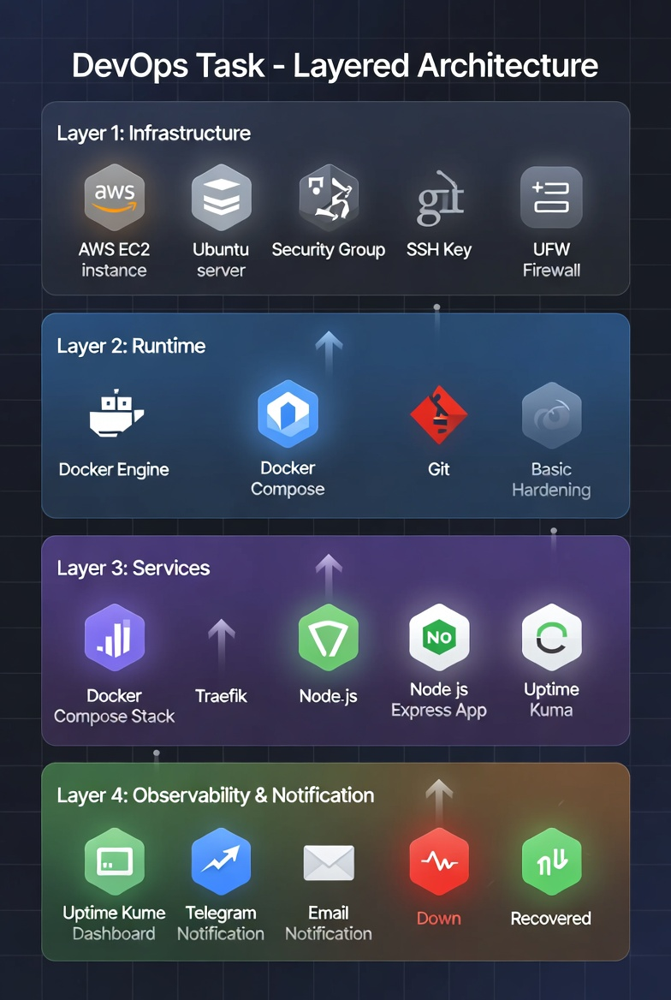

# DevOps Automated Deployment Task


Infrastructure automation using **Terraform** and **Docker Compose** on **AWS**.

# DevOps Monitoring Task 🚀

Automated DevOps setup that provisions a cloud server using Terraform, deploys a Docker Compose stack with Traefik reverse proxy, Node.js Express app, and Uptime Kuma monitoring with Telegram alerts.

---

## Architecture

```
Internet
    ↓
AWS EC2 (Ubuntu)
    ↓
Traefik (Reverse Proxy) → Port 80
    ↓
Node.js Express App → Port 3000
    
Uptime Kuma (Monitoring) → Port 3001
    ↓
Telegram Notifications
```

---

## Stack

| Tool | Purpose |
|------|---------|
| Terraform | Provision AWS EC2 server |
| Docker Compose | Run all services |
| Traefik | Reverse proxy & routing |
| Node.js Express | Application server |
| Uptime Kuma | Monitoring & alerting |
| Telegram | Notifications |

---

## Project Structure

```
devops-task/
├── terraform/
│   ├── main.tf              # EC2 instance
│   ├── provider.tf          # AWS provider
│   ├── variables.tf         # Variables
│   ├── terraform.tfvars     # Values
│   ├── outputs.tf           # Server IP output
│   ├── security-group.tf    # Firewall rules
│   ├── keypair.tf           # SSH key
│   └── cloud-init.sh        # Docker auto-install
│
├── docker/
│   ├── docker-compose.yml   # All services
│   ├── app/
│   │   ├── server.js        # Express app
│   │   ├── package.json
│   │   └── Dockerfile
│   └── traefik/
│       └── traefik.yml
│

│
└── README.md
```

---

## Prerequisites

- Terraform >= 1.0
- AWS Account + Access Keys
- SSH Key Pair
- Docker & Docker Compose

---

## Deployment

### 1. Clone the repo

```bash
git clone https://github.com/saraTharwat666/devops-aws-monitoring-task.git
cd devops-aws-monitoring-task
```

### 2. Configure AWS credentials

```bash
aws configure
# Enter your Access Key ID
# Enter your Secret Access Key
# Region: us-east-1
```

### 3. Provision the server

```bash
cd terraform
terraform init
terraform plan
terraform apply
```

After apply, note the server IP:
```
Outputs:
public_ip = "xx.xx.xx.xx"
```

### 4. Copy Docker files to server

```bash
scp -i ~/.ssh/aws-devops -r ./docker ec2-user@<SERVER_IP>:~/
```

### 5. Deploy the stack

```bash
ssh -i ~/.ssh/aws-devops ec2-user@<SERVER_IP>
cd ~/docker
docker-compose up -d
```

---

## Services

| Service | URL |
|---------|-----|
| Node.js App | `http://<SERVER_IP>` |
| Health Check | `http://<SERVER_IP>/health` |
| Traefik Dashboard | `http://<SERVER_IP>:8080` |
| Uptime Kuma | `http://<SERVER_IP>:3001` |

### Health endpoint response:
```json
{
  "status": "ok"
}
```

---

## Monitoring Setup

1. Open Uptime Kuma at `http://<SERVER_IP>:3001`
2. Create admin account
3. Add monitors:
   - Node.js App: `http://<SERVER_IP>`
   - Health Check: `http://<SERVER_IP>/health`
   - Traefik: `http://<SERVER_IP>:8080`
4. Configure Telegram notification:
   - Settings → Notifications → Add
   - Type: Telegram
   - Add Bot Token & Chat ID

---

## Alerts

- 🔴 **Down alert** — sent when any service is unavailable
- 🟢 **Recovery alert** — sent when service comes back up

---

## Cleanup

```bash
cd terraform
terraform destroy
```

---

## Security

- SSH key authentication only
- Non-root Docker user
- Read-only Docker socket mount
- Security group with minimal open ports (22, 80, 443, 3001, 8080)


